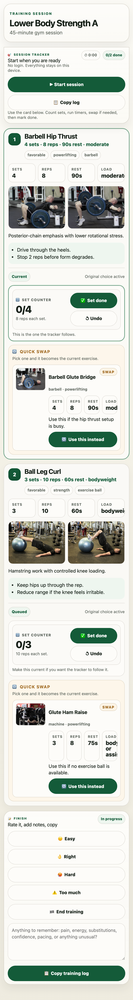

# Training Generator

Generate training sessions with AI, render them into phone-first HTML, publish them to your own Cloudflare Pages site, and log completions back into local state.

## What This Repo Does

- generates structured training sessions from local state and AI prompts
- renders a mobile-friendly session page with timers, counters, swap controls, and compact completion logging
- publishes each session to a stable Cloudflare Pages path with a QR code
- stores completed-session history locally for future planning

In plain terms: this repo helps an agent turn a training idea into a phone page you can use in the gym, then turn the finished workout back into structured state.

## Agent-Native

This repo is designed to be agent-native.

- the main operator workflows are exposed as repo-local skills
- the durable truth is mostly files the user and agent both share
- the phone page emits a compact `TL1` log an agent can parse directly, including bounded session telemetry for later analysis
- publish state stays user-owned in local config and the user's Cloudflare account

The capability map is:
- plan a session: `create-training-plan`
- discover the main workflows: `discover-training-workflows`
- render artifacts from session JSON: `render-training-artifacts`
- publish to Cloudflare: `publish-html-to-cloudflare`
- test the phone runtime: `test-training-session-runtime`
- log a finished workout back into state: `log-training-session`

Architecture notes live in [`docs/agent-native.md`](./docs/agent-native.md).

## Product Boundary

This repo is a generic training generator, not a single-condition product.

- reusable engine: `tools/`, `.codex/skills/`, config templates
- example content: `data/examples/`
- local user state: ignored files under `data/local/` or a configured state path
- generated artifacts: `output/`

The current example data in this repo comes from a rehab-oriented use case, but that is example input, not the public product identity.

If you want to adapt it to your own style or sport, the fastest path is:
- replace the example sessions under `examples/`
- edit `data/local/training-state.json` with your own profile, goals, and history
- add or adjust repo-local skills under `.codex/skills/` to change how the agent plans, publishes, or logs sessions

## Quick Start

```bash
npm install
npm run init
```

Then:

```bash
npm test
npm run html:publish:dry-run -- --title "Smoke Session"
```

`npm run init` now creates two local files:
- `config/training-generator.local.json`: your Cloudflare publishing config
- `data/local/training-state.json`: your user profile, preferences, and training history

## Example

Preview of a rendered session page:



Concrete example files live in [`examples/`](./examples):
- [`lower-body-strength-a.session.json`](./examples/lower-body-strength-a.session.json): structured session payload the renderer consumes
- [`lower-body-strength-a.html`](./examples/lower-body-strength-a.html): rendered phone-first HTML example you can open directly
- [`completed-session-log.txt`](./examples/completed-session-log.txt): compact `TL1` log copied back from the phone page after training, including bounded telemetry
- [`upper-body-strength-b.session.json`](./examples/upper-body-strength-b.session.json): upper-body push-pull strength day with a swap-ready row alternative
- [`upper-body-strength-b.html`](./examples/upper-body-strength-b.html): rendered upper-body example page
- [`upper-body-strength-b.completed-log.txt`](./examples/upper-body-strength-b.completed-log.txt): matching `TL1` log for that upper-body session
- [`conditioning-circuit.session.json`](./examples/conditioning-circuit.session.json): timed conditioning example that exercises the timer path
- [`conditioning-circuit.html`](./examples/conditioning-circuit.html): rendered timed-conditioning example page
- [`conditioning-circuit.completed-log.txt`](./examples/conditioning-circuit.completed-log.txt): matching `TL1` log for the timed circuit

That example flow is:
1. AI or a skill generates the session JSON.
2. The renderer turns it into an interactive HTML training page.
3. The publisher gives it a public Cloudflare URL plus QR code.
4. The athlete completes the session on phone.
5. The page emits a compact `TL1` log with completion data plus bounded telemetry.
6. A logging skill stores that back into local state.

Render the example session locally:

```bash
npm run render:html -- --input examples/lower-body-strength-a.session.json --output output/training-plans/lower-body-strength-a.html
npm run render:html -- --input examples/upper-body-strength-b.session.json --output output/training-plans/upper-body-strength-b.html
npm run render:html -- --input examples/conditioning-circuit.session.json --output output/training-plans/conditioning-circuit.html
```

## Cloudflare Setup

This repo uses Cloudflare Pages Direct Upload with Wrangler.

1. Log in:

```bash
npx wrangler login
```

2. Create or reuse your Pages project:

```bash
npx wrangler pages project create
```

3. Save your project settings in `config/training-generator.local.json`.

4. Publish a rendered HTML file:

```bash
npm run html:publish -- --html-file /absolute/path/to/session.html
```

## Local Config

Copy the example config:

```bash
cp config/training-generator.example.json config/training-generator.local.json
```

Key fields:
- `pagesProject`: your Cloudflare Pages project name
- `pagesSection`: top-level route bucket, default `training`
- `pagesBaseUrl`: optional override for deterministic dry runs or custom domains
- `statePath`: path to the local training-state file that stores the user profile and training history

You can also use environment variables:
- `TRAINING_GENERATOR_CONFIG`
- `CLOUDFLARE_PAGES_PROJECT`
- `CLOUDFLARE_PAGES_BASE_URL`
- `TRAINING_GENERATOR_STATE_PATH`

## Local Training State

The user profile lives inside the training state file, not in the repo identity.

Default path:

```bash
data/local/training-state.json
```

That file is the shared local truth for:
- `profile`: who the training is for and what constraints matter
- `preferences`: how plans should be shaped
- `sessions`: completed training history
- `weight_history`
- `motivation_history`
- `exercise_progression_notes`

The shipped `data/training_state.json` file is only an example seed. After `npm run init`, edit `data/local/training-state.json` with the real user profile and history.

## Core Commands

```bash
npm run help
npm run init
npm test
npm run render:html -- --input /absolute/path/to/session.json --output /absolute/path/to/session.html
npm run render:module-check
npm run artifacts:list
npm run artifacts:delete -- --delete lower-body-strength-a
npm run html:stage -- --html-file /absolute/path/to/session.html
npm run html:deploy-site
npm run html:publish -- --html-file /absolute/path/to/session.html
npm run html:publish:dry-run -- --title "Smoke Session"
npm run html:list-published
npm run html:delete-published -- --path 2026-06-05-lower-body-a-01abcxyz
npm run state:read
npm run state:read-profile
npm run state:list-sessions -- --limit 10
npm run state:read-session -- --session-id 2026-06-05-lower-body-a-abc123
npm run state:update-session -- --session-id 2026-06-05-lower-body-a-abc123 --input /absolute/path/to/session-patch.json
npm run state:delete-session -- --session-id 2026-06-05-lower-body-a-abc123
npm run state:list-exercises -- --limit 10
npm run state:summarize-context
npm run state:validate-log -- --input examples/completed-session-log.txt
npm run plan:pdf -- --input /absolute/path/to/session.html --output /absolute/path/to/session.pdf
```

## How It Fits Together

- `tools/training_rendering.py`: reusable render module for session JSON -> phone-first HTML
- `tools/render_training_plan.py`: thin CLI wrapper around the renderer module
- `tools/manage_training_artifacts.mjs`: lists or deletes rendered HTML/PDF artifacts in `output/training-plans/`
- `tools/cloudflare_pages_site.mjs`: reusable Cloudflare Pages site primitives for stage/list/delete/deploy
- `tools/stage_training_page_publish.mjs`: stages one HTML page into the local site tree and generates its QR
- `tools/deploy_cloudflare_pages_site.mjs`: deploys the local site tree to Cloudflare Pages
- `tools/publish_html_to_cloudflare.mjs`: thin orchestration wrapper that stages then deploys in one command
- `tools/training_state.py`: reads and updates local training history
- `.codex/skills/`: the repo-local agent workflows that generate, publish, and log sessions

## Skills Workflow

Repo-local skills cover the main flow:
- discover the available workflows and next steps
- generate a training session
- render HTML and optional PDF from existing session JSON
- publish the resulting HTML to Cloudflare
- test the interactive phone runtime
- log a completed session
- bootstrap Cloudflare setup on a fresh machine

The intended operator flow is:
1. generate session JSON + HTML
2. publish to Cloudflare
3. open the session on phone
4. complete it and copy the compact `TL1` log
5. paste that log back into chat to update local state

The copied log is intentionally token-light. It is meant for an LLM or skill to parse directly, not for a human to read as a report. The telemetry it carries is bounded on purpose so the copy-back flow stays lightweight.

## Try These Prompts

- `Generate my next training session from my local state.`
- `Render this session JSON into a phone page and a PDF.`
- `Publish this training HTML to Cloudflare and give me the URL and QR.`
- `Stage this training page locally, then deploy the site when I say go.`
- `List my rendered artifacts and published training pages, then delete the stale ones.`
- `Open the latest rendered training page and test the workout interactions.`
- `Here is a TL1 log. Update my local training history and tell me what it means for the next session.`
- `Show me the active profile, recent sessions, and Cloudflare publish context.`

## Empty States

- No local training state yet:
  run `npm run init`, then edit `data/local/training-state.json`.
- No Cloudflare config yet:
  run `npm run init`, then edit `config/training-generator.local.json` and run `npx wrangler login`.
- No plan artifact yet:
  generate a session first or render an existing session JSON with `npm run render:html`.

## Shared Workspace

The repo is intentionally file-first:
- local state lives in `data/local/` unless you override it
- publish config lives in `config/training-generator.local.json`
- generated plans live in `output/training-plans/`
- published-site artifacts live in `output/cloudflare-pages/site/`

That means the user and the agent can inspect the same state without a hidden backend.

## Verification

`npm test` is the baseline public verification path. It checks:
- public product surface
- config/init scaffolding
- publish dry-run behavior
- rendered runtime telemetry behavior

It does not require:
- live AI access
- a real Cloudflare deploy
- a real training history file

## Limits

- This is a local-user workspace, not a hosted multi-user app.
- Cloudflare auth and Pages project ownership remain user responsibilities.
- AI-provider strategy is intentionally thin in this repo; the stable contract is the artifact flow, not one specific model vendor.
