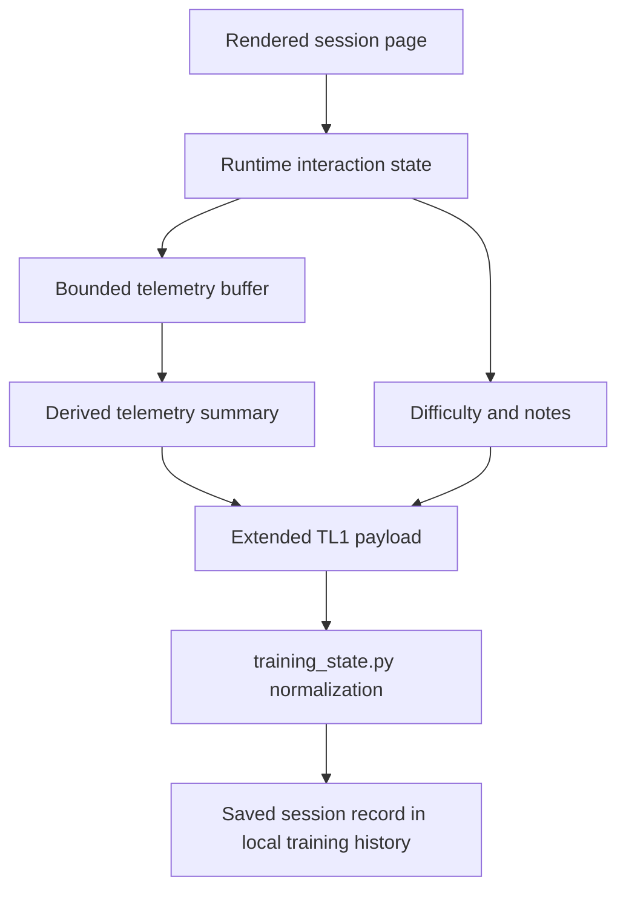

# feat: Add lightweight training telemetry

## Summary

Add bounded passive telemetry to the rendered training session so the existing local-first runtime can capture richer timing and adherence signals, export them through the current `TL1` copy-back log, and store them durably in local training history. The work stays inside the current phone-page-to-chat workflow and does not introduce live sync, dashboards, or automatic plan adaptation.

---

## Problem Frame

The current runtime already tracks meaningful session behavior in browser state, but the exported `TL1` payload only returns a thin completion summary. That leaves future planning blind to timing and adherence patterns the page already observes, such as how long exercises actually occupied, how set pacing unfolded, how rest expanded, and when the user drifted from the default exercise flow.

This feature is not a new journaling product and not an analytics backend. It is a contract-extension and durability change across three connected seams: runtime capture, compact export, and local session storage. The plan needs to keep those seams coherent so the new telemetry is useful later without breaking the current lightweight logging workflow.

---

## Requirements

**Runtime Capture**

- R1. The rendered training session captures passive timing telemetry for the session and for each exercise using existing interaction surfaces rather than a new manual logging flow.
- R2. The captured telemetry preserves enough information to reconstruct session elapsed time, per-exercise elapsed time, per-exercise active windows, and timing relationships between exercise completion and the next exercise start.
- R3. Set-based exercises preserve enough signal to derive set pacing and between-set rest timing.
- R4. Timer-based exercises preserve enough signal to distinguish prescribed timer duration from actual interaction timing around timer use.
- R5. The runtime preserves adherence-relevant interaction signals already expressed during session use, including swaps, reopens, manual completion changes, and exercise-order drift.

**Copy-Back Contract**

- R6. The copied session log includes the new telemetry in a machine-friendly form that remains compatible with the current single-payload copy-back workflow.
- R7. The copied payload remains compact enough that the workflow still feels like lightweight copy/paste logging rather than a verbose export flow.
- R8. The copied payload preserves the stable training/session identifier so telemetry can be joined to the original rendered plan.

**Durable Local Storage**

- R9. The logging flow saves telemetry into local training history in a form that supports later pattern analysis across sessions.
- R10. The saved shape preserves both high-value derived timing metrics and enough bounded underlying context that later analysis is not locked into one early interpretation.
- R11. The telemetry storage stays product-generic and does not assume one injury context, sport, or coaching model.

**Operational Constraints**

- R12. Telemetry collection remains local-device friendly and does not depend on a network round-trip or background sync.
- R13. The telemetry design remains storage-efficient enough for browser-local persistence during normal phone usage.
- R14. The existing human-facing completion signals, including difficulty and notes, remain first-class in the flow.

---

## Key Technical Decisions

- KTD1. **Extend `TL1` instead of introducing a second log contract.** The current repo, docs, examples, and skills already treat `TL1` as the durable browser-to-agent seam. Extending that payload preserves operator workflow continuity and avoids splitting parser and documentation logic across parallel formats.

- KTD2. **Capture bounded interaction history and export derived summaries plus compact context.** The runtime needs more than final totals, but the exported log cannot become a full click replay. The runtime should preserve a small, purpose-built telemetry block that supports later reinterpretation while still favoring derived metrics for the primary stored shape.

- KTD3. **Keep telemetry local to the rendered runtime until copy time.** This work does not justify a networked persistence layer. The existing localStorage-backed runtime already owns session continuity, and the requirements explicitly keep sync and hosted analytics out of scope (see origin: `docs/brainstorms/2026-06-05-lightweight-training-telemetry-requirements.md`).

- KTD4. **Test runtime telemetry as behavior, not only as serialized shape.** The new feature lives in inline browser runtime behavior, not only in Python parsing. Parser-only assertions would miss the timing and interaction regressions this feature introduces, so the implementation should add browser-level verification for the rendered page.

---

## High-Level Technical Design

The runtime remains the only place where raw timing relationships are observed. The implementation therefore keeps event capture and summary derivation inside the rendered page, extends the copied `TL1` contract with a compact telemetry block, then normalizes that block into durable session history alongside the existing planning-facing fields.

---

## System-Wide Impact

- The `TL1` contract is consumed by examples, docs, skills, parser logic, and user prompts, so contract changes need coordinated updates rather than a runtime-only patch.
- Browser-local state becomes more valuable and more complex; state normalization and bounded storage need to be explicit so partially-completed phone sessions remain resilient.
- Runtime verification becomes a product concern, not just a parser concern, because telemetry correctness depends on real interaction order.

---

## Risks & Dependencies

- Richer telemetry can easily overgrow the compact-copy workflow if the runtime exports verbose raw history without a bounded shape.
- The current test surface does not exercise rendered-page behavior. Runtime tests therefore need a browser install step so CI can run deterministic interaction coverage.
- Existing saved sessions and current `TL1` examples must remain readable during the transition; parser evolution should be additive and tolerant rather than assuming every log has telemetry immediately.

---

## Implementation Units

### U1. Add bounded telemetry capture to the rendered runtime

- **Goal:** Extend the session runtime so it records the interaction timing and adherence signals required for later export, without changing the visible operator loop.
- **Requirements:** R1, R2, R3, R4, R5, R12, R13
- **Dependencies:** None
- **Files:** `tools/training_rendering.py`, `tests/node/training-runtime-telemetry.test.mjs`
- **Approach:** Add a bounded telemetry state model alongside the existing session state in the inline runtime. Capture session lifecycle timestamps, exercise-entry and exercise-completion timing, set-completion timing, timer interaction timing, swap/reopen/manual-complete events, and exercise-order drift markers. Keep the stored shape explicitly bounded so local persistence cost scales with a normal session rather than unbounded click history.
- **Patterns to follow:** Follow the existing `state` + `saveState()` + `normalizeState()` runtime pattern in `tools/training_rendering.py`; keep the rendered page self-contained and local-first as described in `docs/agent-native.md`.
- **Verification:** The rendered runtime can be exercised end-to-end and exposes stable telemetry-bearing state through the existing session flow without changing the visible controls or requiring new user input.

### U2. Extend the `TL1` export contract with compact telemetry

- **Goal:** Add a telemetry block to the copied payload that preserves useful derived timing metrics and bounded context while keeping the export compact and machine-friendly.
- **Requirements:** R6, R7, R8, R10, R14
- **Dependencies:** U1
- **Files:** `tools/training_rendering.py`, `examples/completed-session-log.txt`, `README.md`, `docs/agent-native.md`, `tests/node/training-runtime-telemetry.test.mjs`
- **Approach:** Update the runtime summary builder so the existing `TL1` payload carries a compact telemetry section alongside the current top-level fields. Preserve backward continuity of the overall copy-back contract: the payload stays single-line, still includes the stable training identifier, and still keeps difficulty and notes prominent. Regenerate the shipped example log so docs and smoke tests represent the new contract.
- **Patterns to follow:** Preserve the current `TL1 {...}` contract style and the repo’s emphasis on compact machine logs in `README.md` and `docs/agent-native.md`.
- **Verification:** A copied log from the rendered page still fits the current operator workflow while carrying a bounded telemetry extension that downstream tools can parse.

### U3. Normalize and persist telemetry in local training history

- **Goal:** Teach the training-state helper and logging flow to parse the extended payload and store telemetry in a durable, analysis-friendly session shape.
- **Requirements:** R8, R9, R10, R11, R12
- **Dependencies:** U2
- **Files:** `tools/training_state.py`, `data/training_state.json`, `data/examples/rehab-example-state.json`, `.codex/skills/log-training-session/SKILL.md`, `.codex/skills/log-training-session/references/state-and-log-format.md`, `tests/node/training_state.test.mjs`
- **Approach:** Extend `normalize_tl1_log` so telemetry is parsed into a stable normalized structure, then evolve logged-session storage expectations so saved sessions can carry both current planning-facing fields and the new telemetry block. Keep the shape additive and tolerant of older logs that do not yet include telemetry. Update the logging skill reference so saved-state expectations match the new durable contract.
- **Patterns to follow:** Follow the existing additive normalization pattern in `tools/training_state.py`, where helper output is normalized first and only then appended or updated in saved state.
- **Verification:** The helper can accept both old and new `TL1` logs, and saved session history retains telemetry in a product-generic shape suitable for later analysis.

### U4. Add runtime-facing verification and CI support for telemetry behavior

- **Goal:** Raise test confidence from contract-only checks to behavior-level runtime validation, and ensure CI can run the new coverage reliably.
- **Requirements:** R1, R3, R4, R6, R7, R13
- **Dependencies:** U1, U2, U3
- **Files:** `tests/node/training-runtime-telemetry.test.mjs`, `.github/workflows/ci.yml`, `.codex/skills/test-training-session-runtime/SKILL.md`
- **Approach:** Introduce a runtime interaction test path that exercises the rendered page as a real behavior surface, then wire that path into the repo’s verification story and CI expectations. Keep this right-sized: enough real interaction coverage to protect telemetry behavior, not a full hosted test framework. Update the runtime-test skill only where the expected verification loop changes materially.
- **Patterns to follow:** Follow the repo’s existing Node test runner convention in `tests/node/*.test.mjs`; use the runtime truth-surface principle already captured in `.codex/skills/test-training-session-runtime/SKILL.md`.
- **Verification:** `npm test` and CI provide explicit confidence that the rendered page’s telemetry behavior still works, not just that parser helpers can read a fixture.

---

## Scope Boundaries

### Deferred for later

- Automatic future-plan adaptation based on telemetry patterns
- Cross-session analytics or reporting surfaces beyond saved local history

### Outside this product's identity

- Hosted dashboards, live sync, or backend telemetry infrastructure
- Rich journaling workflows beyond the current notes and difficulty surface

### Deferred to Follow-Up Work

- Broader coaching interpretation logic that turns telemetry into progression heuristics
- Any export or ingestion surface beyond the current `TL1` browser-to-agent contract

---

## Sources / Research

- `docs/brainstorms/2026-06-05-lightweight-training-telemetry-requirements.md` for product scope, constraints, and acceptance cases
- `tools/training_rendering.py` for the existing inline runtime state model, `TL1` summary builder, and localStorage persistence flow
- `tools/training_state.py` for current `TL1` normalization and durable session storage seams
- `README.md` and `docs/agent-native.md` for the current product contract around compact copy-back logs and local-first operation
- `tests/node/training_state.test.mjs`, `tests/node/repo_smoke.test.mjs`, and `tests/node/training_rendering_module.test.mjs` for the current thin parser/smoke coverage surface
- `.github/workflows/ci.yml` for the current minimal CI environment, which affects how runtime telemetry verification can be added safely
