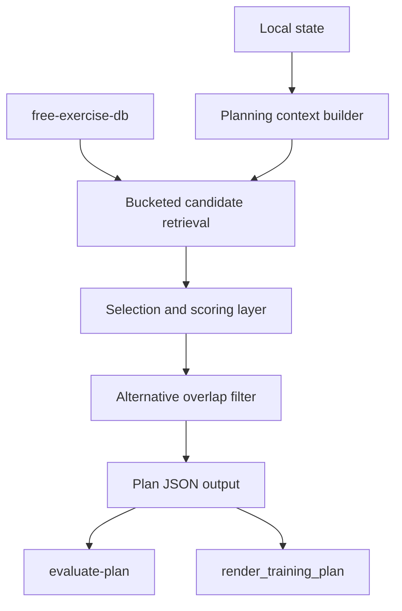

# Retrieval-First Training Planner Refactor

## Summary

Replace the current template-first planner with a retrieval-first planning surface that exposes a broad relevant exercise pool from `free-exercise-db`, local state, and sticky feedback, then lets the model choose the actual session from that constrained pool.

Keep plan validation, rendering, publishing, and logging deterministic. The Python layer should retrieve and validate, not quietly decide the workout.

---

## Problem Frame

The current planner still carries too much policy in code. Even after the recent patch that improved rotation and alternative hygiene, `tools/generate_training_plan.py` remains a narrow handwritten template selector with a small fixed exercise menu. That is better than emitting fake alternatives, but it is still the wrong architecture for this product.

The user requirement is clear: the model should have access to all relevant exercises and choose from there. In the current shape, the planner can only choose from whichever exercises the template author remembered to hardcode. This produces two failures:

- exercise variety collapses too early because the planner is reasoning over a tiny pre-selected surface rather than the relevant candidate pool
- product behavior is encoded in Python branching instead of the shared planning context and model reasoning layer

This repo already has the ingredients for the right design:

- `tools/training_state.py` can summarize state, read recent sessions, read sticky feedback, search exercises, and evaluate plans
- the local state already stores the profile, recent sessions, and planning feedback profile
- `free-exercise-db` is already installed locally and searchable
- plan validation and rendering are already separated from session choice

The refactor should finish the direction described in `docs/plans/2026-06-18-agent-native-planning-refactor.md`, but with a practical constraint: keep the current CLI contract and tests stable enough that the rest of the repo does not break while the planner becomes retrieval-first.

---

## Requirements

### Retrieval Surface

- R1. The planner must build plans from a broad retrieved candidate pool rather than from a small hardcoded exercise bundle.
- R2. Candidate retrieval must be grounded in local state, including profile constraints, equipment access, recent sessions, recent focus counts, and `planning_feedback_profile`.
- R3. Candidate retrieval must preserve real exercise metadata from `free-exercise-db` so the model can make informed tradeoffs instead of choosing from hand-curated labels only.

### Planning Contract

- R4. The Python planner layer must stop making the final session choice via hidden template policy.
- R5. The model-facing planning context must expose enough candidate structure for the model to choose primaries and alternatives from retrieved options.
- R6. The planner must support both stable anchors and wider rotation based on sticky feedback rather than forcing one ideology globally.

### Alternative Quality

- R7. Alternatives must be true substitutes, not the same movement as the primary and not another movement already used as a primary in the same session.
- R8. Alternatives should prefer realistic gym substitutions over fragile floor-only or novelty-only swaps when the primary failure mode is equipment availability.

### Repo Compatibility

- R9. The resulting plan JSON must continue to pass `tools/training_state.py evaluate-plan`.
- R10. The resulting plan JSON must continue to render through `tools/render_training_plan.py` without requiring renderer changes.
- R11. The CLI contract around `tools/generate_training_plan.py --output <path>` must remain available during this refactor, even if its internals become a context-driven planner.

### Testability

- R12. Tests must verify that retrieved alternatives are non-duplicate and non-overlapping with primary selections.
- R13. Tests must verify that recent-history and sticky-feedback signals materially influence candidate choice and session shape.
- R14. The new planner must be testable without live model calls or external services.

---

## Scope Boundaries

### Deferred for later

- The actual interactive Codex planning flow in `.codex/skills/create-training-plan/SKILL.md` can be tightened further after the retrieval surface exists.
- Replacing deterministic plan generation with a live hosted model call is out of scope for this pass.
- Overhauling `training_state.py` search semantics or risk taxonomy beyond what is needed for candidate retrieval is out of scope.

### Outside this product's identity

- The planner does not need to become a generic optimization engine or recommender system.
- This refactor is not about adding backend state, cloud inference, or a new persistence layer.
- The renderer and telemetry flows are not being redesigned here.

---

## Key Technical Decisions

- KTD1. Keep `tools/generate_training_plan.py` as the external entrypoint, but rewrite it as a retrieval-first planner wrapper rather than replacing it with a new command immediately. This preserves the current repo contract while allowing the internal architecture to change.
- KTD2. Introduce an explicit internal planning-context shape that separates retrieved candidates from final chosen exercises. The context becomes the load-bearing contract; the final plan becomes a transformation of that context rather than a hardcoded template emission.
- KTD3. Split exercise selection into two layers: candidate retrieval and candidate selection. Retrieval remains deterministic and testable; selection remains rule-driven in this refactor, but consumes the broader candidate pool so later model-authored selection can replace only that layer.
- KTD4. Treat recent-history avoidance and sticky feedback as scoring inputs, not as binary branch gates. This avoids the current collapse into one or two hardcoded tracks while preserving user-specific planning behavior.
- KTD5. Validate alternatives post-selection with a hard overlap filter. Alternative correctness is too important to leave as a best-effort retrieval convention.
- KTD6. Prefer pattern buckets over handwritten session templates. The planner should retrieve candidates for slots like knee-dominant, hinge/posterior-chain, hamstring accessory, trunk, horizontal push, horizontal pull, vertical pull, and simple conditioning, then compose from those buckets.

---

## High-Level Technical Design

The planner becomes a four-stage pipeline:

1. Read context from local state.
2. Retrieve relevant candidates for each needed movement bucket.
3. Score and choose primaries plus alternatives from those buckets.
4. Emit plan JSON, then run the existing structural eval and rendering flow unchanged.

The load-bearing change is that `E` no longer chooses from a tiny handwritten exercise list. It chooses from the retrieved candidate buckets produced by `D`.

---

## Implementation Units

### U1. Introduce an explicit planning-context and candidate-bucket builder

- **Goal:** Move retrieval logic and planning inputs into a first-class internal context object so the planner no longer reasons over hidden hardcoded bundles.
- **Files:** `tools/generate_training_plan.py`, `tools/training_state.py`
- **Patterns:** Follow the neutral retrieval direction already described in `docs/plans/2026-06-18-agent-native-planning-refactor.md`. Reuse existing `training_state.py` helpers instead of duplicating state parsing logic.
- **Changes:**
  - Define a compact internal planning-context structure with:
    - recent sessions
    - recent focus counts
    - profile and preferences
    - planning feedback profile
    - recent exercise names
    - recommended attention flags derived from recent constraints
  - Add bucketed candidate retrieval for the main session slots the planner uses.
  - Make retrieval broad enough that the selection layer sees multiple realistic options per slot.
- **Test Scenarios:**
  - A state with repeated lower sessions produces lower-body and upper-body candidate buckets rather than a single prewritten lower template.
  - A state with commercial gym access surfaces machine-based hamstring options like `Seated Leg Curl` and `Lying Leg Curls`.
  - A state with rotation feedback produces candidate sets that are not dominated by the exact recent exercise names.

### U2. Replace template-first selection with bucket-first scoring and composition

- **Goal:** Choose primary exercises from retrieved candidate buckets using local state and sticky feedback, rather than selecting from handwritten exercise bundles.
- **Files:** `tools/generate_training_plan.py`
- **Patterns:** Preserve the current plan output schema and evaluation contract. Keep reasoning explicit in `planning_context.influences`.
- **Changes:**
  - Replace template overlap logic with slot-by-slot candidate scoring.
  - Use recent exercise overlap, recent session focus, and rotate/repeat feedback as inputs to score primaries.
  - Preserve anchor movements when repeat feedback is strong, but widen selection when recent repetition is high or rotate feedback is present.
  - Generate the final plan from chosen slots, not from prewritten plan templates.
- **Test Scenarios:**
  - A repeated lower-session history plus rotate feedback shifts the next session toward a different emphasis without losing history grounding.
  - A stable-history case with no rotate pressure still permits proven anchors to remain in the plan.
  - The produced `planning_context.influences` still references a real recent session and describes the adjustment clearly enough for `evaluate-plan`.

### U3. Enforce alternative quality as a hard post-selection rule

- **Goal:** Guarantee that alternatives are usable substitutes rather than fake or overlapping suggestions.
- **Files:** `tools/generate_training_plan.py`, `tests/node/training_generation_flow.test.mjs`
- **Patterns:** Keep the current overlap-filter idea, but run it against retrieved alternatives and primary selections rather than hardcoded exercise lists.
- **Changes:**
  - Build alternative candidates from the same movement bucket as the primary when possible.
  - Filter out:
    - the primary exercise itself
    - another primary already selected in the session
    - duplicate alternatives within the same card
  - Prefer alternatives with different equipment/setup when the primary's likely failure mode is availability.
- **Test Scenarios:**
  - No alternative shares the same `exercise_id` as its primary.
  - No alternative reuses another primary's `exercise_id`.
  - A hamstring slot with a machine primary produces a different machine or practical substitute rather than the same movement or a dead-end fallback.

### U4. Preserve repo contracts and improve plan-generation tests

- **Goal:** Land the refactor without breaking the existing generation, eval, and rendering flow.
- **Files:** `tests/node/training_generation_flow.test.mjs`, `tests/node/training_state.test.mjs` when needed, `tools/generate_training_plan.py`
- **Patterns:** Reuse the existing flow test harness rather than introducing a second planner test surface.
- **Changes:**
  - Update flow tests so they stop asserting narrow template-specific strings that no longer define the architecture.
  - Add assertions for candidate-driven outcomes:
    - valid plan structure
    - non-duplicate alternatives
    - history-driven rotation
    - realistic slot selection from a wider pool
  - Keep the renderer verification path in place to prove schema compatibility.
- **Test Scenarios:**
  - `node --test tests/node/training_generation_flow.test.mjs` passes.
  - A generated plan from the repo's real local state still passes `evaluate-plan`.
  - The rendered HTML still includes the chosen exercises and remains structurally valid.

### U5. Tighten planner documentation around the new architecture

- **Goal:** Align the docs with the retrieval-first planner surface so the repo no longer presents the Python layer as the hidden workout chooser.
- **Files:** `README.md`, `.codex/skills/create-training-plan/SKILL.md`, optionally `docs/plans/2026-06-18-agent-native-planning-refactor.md` via reference note if follow-up is useful
- **Patterns:** Keep public wording product-generic per `AGENTS.md`. Describe the planner as retrieval-first and validation-backed.
- **Changes:**
  - Update the README description of `tools/generate_training_plan.py`.
  - Update the planning skill to treat the script as a retrieval-first baseline rather than a workout template engine.
  - Clarify that deterministic validation remains, but exercise choice comes from a broad candidate pool.
- **Test Scenarios:**
  - README and skill copy no longer claim or imply that the planner chooses from a fixed bundle.
  - The planning skill instructions remain compatible with the actual generator behavior.

---

## Risks & Dependencies

- **Risk:** The refactor still ends up quasi-template-driven if candidate buckets are too narrow.
  - **Mitigation:** Make tests assert plurality in candidate sources and avoid template-name-based expectations.

- **Risk:** A broader candidate pool increases noisy or impractical choices.
  - **Mitigation:** Keep deterministic scoring and overlap filters narrow and explicit; use local state and equipment access as strong constraints.

- **Risk:** The repo conflates "retrieval-first" with "live model-planned."
  - **Mitigation:** Document the determinism boundary clearly: retrieval and validation are deterministic in this pass; future live model selection can replace only the selection layer.

- **Dependency:** `free-exercise-db` remains the core exercise source and must be locally present.

- **Dependency:** `training_state.py search-exercises` must stay stable enough to support bucket retrieval without reintroducing planner policy through hidden recommendation language.

---

## Sources / Research

- `docs/plans/2026-06-18-agent-native-planning-refactor.md`
  - prior repo plan that already argued for a context-builder and prompt-native planning direction
- `tools/generate_training_plan.py`
  - current implementation showing the remaining template-first bottleneck
- `tools/training_state.py`
  - existing retrieval, TL1, logging, and validation primitives the refactor should build on
- `tests/node/training_generation_flow.test.mjs`
  - current integration test surface that must stay green while planner internals change
- `README.md`
  - current public description of `tools/generate_training_plan.py` as a deterministic baseline generator
