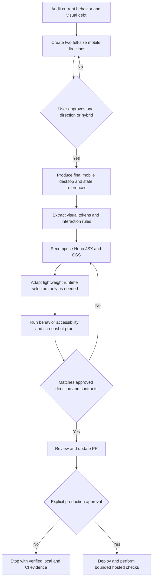
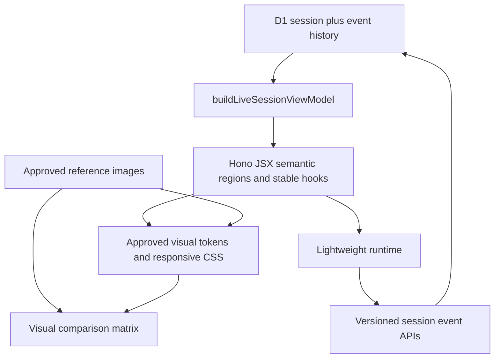

# feat: Build a branded Flue live-session experience

## Goal Capsule

- **Objective:** People training with Flue get a fast, distinct, professional live-session experience that feels intentionally designed rather than assembled from generic dark cards.
- **Means:** Establish and approve a high-fidelity Flue visual direction before translating it into the existing Hono JSX session surface (KTD1, KTD2).
- **Authority:** This plan governs product and implementation scope; the approved reference images govern visual composition; existing event and API contracts govern training data behavior.
- **Execution profile:** Design-gated implementation with local proof first; production deploy and live state mutation still need explicit approval.
- **Stop conditions:** Stop before implementation if no visual direction earns approval; stop before production deploy or live mutation checks without explicit user approval.
- **Owner:** The implementing agent carries the work through local verification, review, and PR update. The user approves the visual direction and any production action.

---

## Product Contract

### Summary

Create a small but ownable Flue visual system, use it to produce separate high-fidelity mobile and desktop references, obtain approval, and then rebuild the live training session to match those references without changing its structured training-data contract.

### Problem Frame

The current screen is more useful than its predecessor, but it still relies on familiar AI-generated defaults: nested rounded panels, repeated pills, system type, broad mint accents, and a mobile composition stretched across desktop. Geometry checks proved that controls fit; they did not prove that the interface has a coherent identity, rhythm, or finish.

This work must separate visual design from implementation. CSS is the translation step, not the place where the product's visual direction is invented.

### Key Decisions

- **Design before code.** The user must approve a high-fidelity direction before production markup or styles change. Governs R1, R2, R9.
- **Live-session scope first.** Shared tokens may be designed for later reuse, but this pass changes the hosted live session rather than redesigning home or chat. Governs R3, R11.
- **Training data behavior remains stable.** Visual changes must not alter the structured event trail or mutation safeguards. Governs R4, R5, R6, R7.

### Requirements

**Visual direction**

- R1. The work must present at least two materially distinct Flue visual directions as full-size mobile live-session references, not moodboards or minor color variants.
- R2. The chosen direction must define an ownable product system: wordmark treatment, typography, color roles, spacing, radius logic, surface treatment, icon style, imagery treatment, and motion rules.
- R3. The system must remain phone-first and gym-fast while defining a deliberate desktop composition rather than scaling up the mobile stack.
- R4. The current prescribed set, actual reps/load inputs, optional per-set note, and single logging action must remain the first visual priority.
- R5. Planned set totals must remain fixed from `prescription.sets`; logging beyond that total must read `Add extra set` without changing the prescribed total.
- R6. Exercise title, prescription, timer, saved-set feedback, form/media/swaps, proposals, and session notes must retain clear but lower visual priority.
- R7. Mint or any successor accent must have a strict semantic role, primarily active logging, live status, and positive confirmation, rather than decorating every label and container.
- R8. The final composition must avoid generic UI patterns called out in the review: card-within-card stacks, pill spam, repeated bordered metric tiles, arbitrary glow, default system typography without intent, and oversized rounded containers around every region.
- R9. Mobile and desktop designs must each have approved, fresh reference images; desktop may not be a crop or simple expansion of the mobile reference.

**Behavior and data**

- R10. Existing structured writes must remain machine-ready for the coach: `set_logged` retains exercise ID, set number, reps, load, and optional note; effort flags, session notes, completion events, proposals, and replayed live state retain their current contracts.
- R11. The implementation must stay server-rendered with Hono JSX and a lightweight browser runtime unless the approved design proves that the current architecture cannot support a required interaction.
- R12. Completed sessions must remain read-only at both UI and server boundaries, while non-mutating navigation remains usable where the final design exposes it.
- R13. Pending, error, disabled, loading, empty, active-rest, completed, and extra-set states must look intentional and remain accessible.
- R14. The design must support touch targets of at least 44 CSS pixels, visible keyboard focus, sufficient text/control contrast, safe-area insets, reduced motion, and no control/content overlap at supported widths.

**Approval and proof**

- R15. Implementation cannot begin until the user approves one visual direction or an explicit hybrid.
- R16. Final review must compare implementation screenshots with the approved references at the same viewport sizes and record material deviations.
- R17. Production deployment and any hosted mutation test require separate explicit approval under the production-data rule.

### Success Criteria

- At 390×844, exercise identity, prescribed/current set state, reps and load controls, per-set note, primary logging action, and rest control are usable without content being hidden by navigation or safe areas.
- At 1440×1200, the session uses the available space with an intentional desktop layout and no fixed bar overlaps content.
- A reviewer can identify the Flue screen without relying on its text label because typography, composition, color use, and interaction treatment form one coherent system.
- The final screenshot comparison has no unexplained high-impact deviation from the approved references.
- All existing live-session data, replay, proposal, and read-only tests pass, with added coverage for any changed DOM/runtime contract.

### Acceptance Examples

- AE1. **Covers R4, R5.** Given a three-set exercise with zero logs, when the session opens on a 390×844 viewport, then `Set 1 of 3`, reps, load, optional note, and one `Log set` action are clear in the primary work area.
- AE2. **Covers R5.** Given three prescribed sets and three saved sets, when the exercise renders, then the prescribed total still reads three and the action reads `Add extra set`.
- AE3. **Covers R10.** Given a user enters 10 reps, 50 kg, and a form note, when they log the set, then one structured `set_logged` event contains those values and the relevant exercise/set identifiers.
- AE4. **Covers R12.** Given a completed session, when the user opens it, then write controls cannot mutate state, server write attempts return the existing read-only conflict, and any available view navigation still works.
- AE5. **Covers R13, R14.** Given a set write fails or remains pending, when the state appears, then the error or pending feedback stays next to the action, controls retain accessible focus/disabled states, and the layout does not jump under fixed navigation.
- AE6. **Covers R9, R16.** Given approved mobile and desktop references, when implementation screenshots are captured at matching sizes, then each material visual difference is either corrected or recorded with a reason and user approval.

### Scope Boundaries

**In scope**

- Flue live-session brand direction and compact product identity treatment.
- High-fidelity mobile and desktop reference images plus key state references.
- Live-session tokens, composition, typography, icon treatment, interaction finish, and responsive behavior.
- Existing UI/runtime selector changes needed to implement the approved composition safely.
- Tests and local screenshot proof.

**Deferred to Follow-Up Work**

- Applying the new system to home, chat, history, and profile screens.
- A full corporate brand kit, marketing site, or broad logo exploration beyond what the product UI needs.
- New coaching, analytics, profile-learning, or training-recommendation behavior.
- Making newly logged saved-set chips appear without reload unless the approved design makes that state essential to the primary flow.
- Production deployment and real hosted mutations until explicit approval is granted.

---

## Planning Contract

### Key Technical Decisions

- KTD1. **Use an image-first design gate.** `(session-settled: user-approved — chosen over continued CSS iteration: the current result proved that incremental styling can improve hierarchy without creating a professional identity.)` Generate standalone, readable references before changing production UI.
- KTD2. **Treat approved references as the visual source of truth.** Implementation decisions should be measured against them; the design document records tokens and behavior that images cannot express.
- KTD3. **Keep behavior contracts independent from visual composition.** Preserve the view-model and event semantics, and retain stable `data-*` hooks where possible so visual work does not silently change logging behavior.
- KTD4. **Use one explicit viewport shell and one scroll owner.** The final structure must account for `100dvh`, safe-area insets, keyboard opening, and sticky/fixed action regions without desktop or mobile overlap.
- KTD5. **Prefer local, dependency-light assets.** Use license-safe typography and icons that can ship with the Worker or through a deliberate, documented asset path; do not add a large UI framework for visual polish.
- KTD6. **Verify design with stateful screenshots, not geometry alone.** Proof includes reference-vs-build comparisons across active logging, post-log/rest, extra-set, completed/read-only, long-copy, and error states.

### High-Level Technical Design

The work has a gated lifecycle and a cross-layer contract, so both are explicit.

The first diagram governs sequencing and approval. The second shows the boundary: design may change presentation and selector placement, but the D1/event loop remains authoritative.

### Design Deliverables

Store durable design artifacts under `docs/design/live-session/`:

- `visual-brief.md`: audience, gym context, brand attributes, anti-patterns, content hierarchy, and accessibility constraints.
- `direction-a-mobile.png` and `direction-b-mobile.png`: distinct full-size concepts at 390×844.
- `approved-mobile.png`: final active-set reference after review.
- `approved-desktop.png`: fresh 1440×1200 desktop composition.
- `approved-states.png`: readable state-specific references for post-log/rest, extra-set, pending, error, disabled, loading, empty, and completed/read-only behavior. Use separate full-size images when one board would reduce legibility.
- `visual-system.md`: approved wordmark treatment, tokens, typography licensing/loading, semantic colors, spacing/radius rules, icon and imagery treatment, motion guidance, responsive rules, and exceptions agreed during review.
- `comparison.md`: final reference-vs-implementation screenshot links with deviations and dispositions.

Generated text in image concepts is not authoritative. Product copy comes from the plan, session data, and existing UI contracts.

### Sequencing and Approval Gates

1. Characterize current behavior and create the visual brief.
2. Generate two directions and stop for user selection.
3. Turn the selected direction into final responsive/state references and explicit tokens, then stop for explicit approval of the final mobile and desktop references.
4. Implement against the approved artifacts without altering structured training behavior.
5. Verify behavior, accessibility, responsiveness, and visual fidelity locally and in CI.
6. Update the PR. Deploy only after separate production approval.

### Risks and Mitigations

- **Generated references may contain impossible or illegible details.** Regenerate unclear sections as fresh full-size images, then extract a feasible system before implementation.
- **Brand polish may reduce gym speed.** R4, AE1, touch-size checks, and first-viewport proof outrank decoration.
- **Selector changes may break event logging.** Preserve stable hooks where possible and add renderer/runtime contract tests before restructuring.
- **A custom font may hurt load time or licensing.** Select a license-safe family, self-host only the needed files/weights where practical, and verify fallback behavior and bundle/network cost.
- **Fixed controls may cover content or fight the keyboard.** Use one scroll owner, safe-area padding, and browser checks at short/tall mobile heights and desktop.
- **The design phase may drift into a full product rebrand.** Keep deliverables tied to the live-session use case and defer broad surface rollout.

### Research Sources

- `src/session/LiveTrainingSession.tsx` — current semantic hierarchy and runtime hooks.
- `src/session/live-session-styles.mjs` — current dark/mint token set, responsive rules, and overlap-prone fixed desktop navigation.
- `src/session/live-session-view-model.mjs` — fixed prescribed totals, replayed set state, plan-note extraction, and media fallbacks.
- `src/session/live-session-runtime.mjs` — pending guards, event writes, timer behavior, navigation, and completion lockout.
- `src/routes/session-api.mjs` — D1 read/write boundaries and completed-session rejection.
- `tests/node/live_session_renderer.test.mjs` and `tests/node/live_session_view_model.test.mjs` — current contract coverage.
- `DESIGN.md` — current product intent; U1 separates durable shared principles from live-session-specific guidance, and U3 records the approved system without discarding the phone-first, calm, fast goals.

---

## Implementation Units

### U1. Establish the visual brief and behavior baseline

- **Goal:** Define what the design must express and freeze the behavior contracts it may not break.
- **Requirements:** R2, R4–R8, R10–R14.
- **Dependencies:** None.
- **Files:** `DESIGN.md`, `docs/design/live-session/visual-brief.md`, `tests/node/live_session_renderer.test.mjs`, `tests/node/live_session_view_model.test.mjs`, `tests/node/live_session_runtime.test.mjs`, `tests/node/session_api.test.mjs`, `tests/node/d1-training-store.test.mjs`.
- **Approach:**
  1. Audit the existing mobile and desktop screenshots against the requirements and record the specific generic patterns to remove.
  2. Define three to five Flue brand attributes in observable visual terms, plus explicit anti-patterns and the gym-use content hierarchy.
  3. Document all stable DOM/data hooks and behavior contracts before markup work.
  4. Add characterization assertions where current safety depends on selectors or semantic ordering that tests do not yet pin.
  5. Update `DESIGN.md` so shared guidance distinguishes durable product principles from the live-session-specific visual system.
- **Patterns to follow:** Existing structured view-model boundary and renderer tests.
- **Test scenarios:**
  - Render an active planned session and confirm each required unique ID exists once, while repeated logging, effort, and proposal hooks appear once per rendered control and remain scoped to the correct exercise or proposal.
  - Execute the current browser runtime against intercepted requests and pin set, note, effort, completion, and proposal routes and payloads before changing markup.
  - Exercise completed-session writes at the API/store boundary and pin the existing 409 `session_read_only` response and no-mutation result.
  - Render planned, extra-set, empty, long-copy, media-fallback, and completed states and confirm each exposes the data needed by the design without changing event semantics.
  - Confirm the set logger precedes secondary details in the rendered DOM; U5 verifies actual keyboard order in a browser.
- **Verification:** The visual brief is concrete enough to reject a generic concept, and focused tests characterize every behavior boundary that visual implementation will touch.

### U2. Create and select the Flue visual direction

- **Goal:** Obtain an approved, distinct design direction before production UI implementation.
- **Requirements:** R1–R4, R7–R9, R14, R15.
- **Dependencies:** U1.
- **Files:** `docs/design/live-session/direction-a-mobile.png`, `docs/design/live-session/direction-b-mobile.png`, `docs/design/live-session/visual-brief.md`.
- **Approach:**
  1. Generate two standalone 390×844 active-session images that share the product hierarchy but differ materially in typography, composition, surface logic, and brand expression.
  2. Keep text and controls large enough to inspect; regenerate unclear sections rather than cropping or enlarging a composite.
  3. Review each direction against gym speed, distinctiveness, accessibility, technical feasibility, and the anti-pattern list.
  4. Present both at native size with a concise trade-off note and request one explicit choice: direction A, direction B, or a named hybrid.
- **Execution note:** This unit ends at a user approval gate. Do not alter `src/session/` before that approval.
- **Test scenarios:** Test expectation: none — this unit produces design references, and its proof is structured visual review against R1–R9 and explicit approval.
- **Verification:** Two genuinely distinct, readable concepts exist and the user's selected direction is recorded in `visual-brief.md` without vague “make it nicer” instructions.

### U3. Produce the approved responsive system and state references

- **Goal:** Turn the selected concept into implementation-ready visual rules and references.
- **Requirements:** R2–R9, R13–R16.
- **Dependencies:** U2.
- **Files:** `docs/design/live-session/approved-mobile.png`, `docs/design/live-session/approved-desktop.png`, `docs/design/live-session/approved-states.png`, `docs/design/live-session/visual-system.md`, `docs/design/live-session/visual-brief.md`.
- **Approach:**
  1. Generate a clean final mobile active-set reference and a fresh desktop composition from the selected direction.
  2. Generate readable state references for active rest, post-log feedback, pending, error, disabled, loading, empty, all planned sets logged/extra set, and completed/read-only states.
  3. Extract the wordmark treatment, exact semantic color roles, type scale, font files/weights, spacing, radii, surface layers, icons, imagery, focus, pressed, disabled, and reduced-motion rules. Record resolved foreground/background contrast checks against WCAG 2.2 AA: at least 4.5:1 for normal text, 3:1 for large text and non-disabled UI components, and 3:1 for focus indicators against adjacent colors.
  4. Specify the mobile viewport shell, desktop layout regions, one scroll owner, safe-area handling, and keyboard behavior.
  5. Run a feasibility check against Hono JSX and the current lightweight runtime; revise the references rather than inventing unsupported implementation during coding.
  6. Present the final mobile, desktop, and state references at native size and record the user's explicit approval in `visual-brief.md`.
- **Execution note:** U4 cannot start until the final mobile and desktop references are approved; approval of a U2 direction alone does not approve an unreviewed desktop composition.
- **Test scenarios:** Test expectation: none — this unit produces design specifications; proof comes from reference completeness, legibility, feasibility review, and explicit approval.
- **Verification:** An implementer can identify every major visual and responsive choice without designing through CSS, no material feel question remains unresolved, and approval of the final mobile and desktop references is recorded.

### U4. Rebuild the live-session composition against the approved system

- **Goal:** Implement the approved mobile and desktop designs while preserving session behavior and data contracts.
- **Requirements:** R3–R14.
- **Dependencies:** U3.
- **Files:** `src/session/LiveTrainingSession.tsx`, `src/session/live-session-styles.mjs`, `src/session/live-session-view-model.mjs`, `src/session/live-session-runtime.mjs`, `tests/node/live_session_renderer.test.mjs`, `tests/node/live_session_view_model.test.mjs`, `tests/node/live_session_runtime.test.mjs`, `tests/node/session_api.test.mjs`, `tests/node/d1-training-store.test.mjs`, plus license-safe local font/icon assets if selected in U3.
- **Approach:**
  1. Recompose semantic regions in Hono JSX to match the references while retaining stable logging and proposal hooks.
  2. Replace the monolithic generic styling vocabulary with named semantic tokens and responsive regions from `visual-system.md`.
  3. Implement one viewport shell and scroll owner, including safe-area and on-screen-keyboard handling.
  4. Adapt runtime selectors only where markup changes require it; retain event payloads, idempotency, pending guards, local errors, timer rules, and completion rejection. Expose pending/loading state programmatically, announce saved/error feedback through an appropriate live status region, and keep disabled state from relying on color alone.
  5. Keep non-mutating navigation usable after completion while disabling all write actions; do not use a blanket control-disable pass that also disables navigation.
  6. Exercise the rendered browser runtime with intercepted requests, and verify the API/store boundary separately, so selector changes cannot pass tests while breaking payloads or completed-session enforcement.
- **Execution note:** Start from the characterization coverage in U1; behavior changes require an explicit requirement rather than a visual convenience.
- **Patterns to follow:** `buildLiveSessionViewModel()` as the presentation-data boundary; `postEvent()` and `withPending()` as the mutation path; current server-side `session_read_only` enforcement.
- **Test scenarios:**
  - Covers AE1. Render a three-set active exercise and confirm the primary logger has the approved semantic order, one `Log set` action, and no duplicate set action in navigation.
  - Covers AE2. Replay three prescribed logs and confirm the fixed total, completed planned-set label, and `Add extra set` action.
  - Covers AE3. In a browser-executed runtime test, enter reps, load, and a per-set note, activate the one set action, and confirm exactly one outgoing `set_logged` request preserves the exercise ID, set number, reps, load, note, active version, and idempotency behavior.
  - Covers R10. Exercise effort flags, session notes, completion, proposal apply/reject, and replayed state; confirm their existing routes, event types, payload fields, and rendered values remain unchanged.
  - Covers AE4. Render and operate a completed session; write controls remain blocked while allowed view navigation still works. At the route boundary, attempt every write exposed by the page against a completed fixture and assert the existing 409 `session_read_only` response with no stored-state change.
  - Covers AE5. Simulate pending and failed writes in the browser runtime; confirm duplicate actions are blocked, pending state is exposed programmatically, saved/error feedback is announced next to the action, entered values remain intact, and controls recover after failure.
  - Render missing prescription values, long plan copy, broken media, proposals, and no exercises; each stays legible without breaking the shell.
  - Operate rest start/pause/reset and confirm active emphasis follows the approved state reference and reduced motion remains usable.
- **Verification:** Focused renderer, view-model, browser-runtime, API, and store tests pass; the DOM has no stale selectors; and implementation screenshots match the approved structure at target widths.

### U5. Add visual, responsive, and accessibility proof

- **Goal:** Make visual quality and gym usability reviewable rather than subjective or geometry-only.
- **Requirements:** R3, R7–R9, R13–R16.
- **Dependencies:** U4.
- **Files:** `tests/node/live_session_visual.test.mjs`, `docs/design/live-session/comparison.md`, deterministic local screenshot fixtures and implementation captures linked from the comparison.
- **Approach:**
  1. Add a deterministic Playwright fixture under the existing Node test runner that does not touch production D1 state and fails on uncaught page or console errors.
  2. Capture active logging at 390×844 and 1440×1200, plus short-mobile, post-log/rest, extra-set, pending, error, disabled, loading, empty, long-copy, and completed/read-only states.
  3. Check overflow, content/control overlap, every interactive target's 44×44 CSS-pixel minimum, focus visibility/order, the WCAG 2.2 AA contrast thresholds recorded in `visual-system.md`, safe-area padding, and reduced motion. At 200% browser zoom, confirm the primary flow still reflows without clipped or overlapping labels or controls. Test keyboard resilience by focusing the set-note field and contracting the viewport height by a documented keyboard-sized amount; do not claim that desktop emulation opened a real mobile keyboard.
  4. Place approved and implementation screenshots side by side in `comparison.md`; list each material deviation with corrected, accepted, or blocked status and obtain user approval for any accepted material deviation.
  5. Review the result at native size, not only as thumbnails, and make one final polish pass based on observed defects.
- **Test scenarios:**
  - Covers AE6. Capture mobile and desktop at the same dimensions as approved references and report every material deviation.
  - At 320×568, 390×844, 430×932, and 1440×1200, no navigation or primary action covers content, including a nonzero safe-area fixture.
  - With long exercise names, verbose plan guidance, 200% browser zoom, and a focused input under the contracted-height keyboard proxy, primary logging remains reachable and labels do not collide.
  - Keyboard-only interaction reaches controls in visual order with a visible focus state; every interactive target meets the 44×44 minimum; reduced-motion mode removes nonessential movement without hiding state.
  - Pending, error, disabled, loading, empty, active-rest, completed, and extra-set fixtures match their approved treatments and retain accessible names and status feedback.
- **Verification:** The explicit browser command passes, screenshot artifacts and the comparison document show no unexplained high-impact mismatch, and automated browser checks catch overlap and accessibility regressions.

### U6. Complete review, PR handoff, and bounded rollout

- **Goal:** Ship a reviewable PR update and prepare a safe production validation path without mutating production prematurely.
- **Requirements:** R10–R17.
- **Dependencies:** U5.
- **Files:** PR description and review evidence; no additional product file is required unless review finds a defect.
- **Approach:**
  1. Run the full unit, module-render, Worker dry-run, browser, diff, and screenshot gates.
  2. Obtain a code review focused on event-contract preservation, completed-session safety, responsive shell behavior, and fidelity to approved references.
  3. Update the PR with reference and implementation images, comparison findings, test evidence, known deviations, and rollback criteria.
  4. Stop before deploy unless the user explicitly approves the exact production action.
  5. After approval, deploy the reviewed commit and perform bounded Cloudflare Access checks. Before each hosted write request, including an intentional rejected write to a completed session, state the target session, exact request or script, expected result, and backup or rollback plan, then wait for explicit approval for that exact action.
- **Test scenarios:**
  - Anonymous requests still follow the existing Cloudflare Access behavior.
  - A read-only hosted page renders after deploy without a state write.
  - If separately approved, a designated active test-session set log persists and replays with reps, load, and note.
  - If separately approved, one specified write request against a designated completed test session returns `session_read_only` and leaves stored state unchanged.
- **Verification:** CI passes on the reviewed commit, the PR contains native-size visual proof, and any production action has explicit approval, a stated target/effect, and rollback plan.

---

## Verification Contract

| Gate | Command or method | Proves | Applies after |
|---|---|---|---|
| Direction approval | Native-size review of both 390×844 directions; record the selected direction or named hybrid in `docs/design/live-session/visual-brief.md` | The first implementation gate in R15 has been met | U2 |
| Final reference approval | Native-size review of final mobile, desktop, and state references; record explicit approval in `docs/design/live-session/visual-brief.md` | The fresh mobile and desktop references required by R9 are approved before U4 | U3 |
| Focused contracts | `node --import tsx --test tests/node/live_session_renderer.test.mjs tests/node/live_session_view_model.test.mjs tests/node/live_session_runtime.test.mjs tests/node/session_api.test.mjs tests/node/d1-training-store.test.mjs` | Structured logging and other write payloads, fixed prescribed totals, stable hooks, replay, proposal behavior, and UI/server read-only protection | U1, U4 |
| Full repository suite | `npm test` | No regression across hosted and local training flows | U4–U6 |
| Render import check | `npm run render:module-check` | Existing local rendering fallback still imports and renders | U6 |
| Worker package check | `npm run worker:deploy:dry-run` | Worker bundle and deploy configuration remain valid | U4–U6 |
| Browser state matrix | `node --import tsx --test tests/node/live_session_visual.test.mjs` against deterministic local fixtures | Responsive layout, all required states, 44×44 targets, nonzero safe-area handling, WCAG 2.2 AA contrast thresholds, 200% zoom reflow, keyboard-height resilience, focus order/visibility, reduced motion, and overlap checks | U5–U6 |
| Visual fidelity review | Native-size reference-vs-build review recorded in `docs/design/live-session/comparison.md`, with user approval for any accepted material deviation | Approved art direction reached the implementation, and deviations have a disposition | U5–U6 |
| Diff quality | `git diff --check` and scoped code review | Clean patch, no stale selectors, no accidental generated-artifact churn | U6 |
| Hosted smoke check | Cloudflare Access read-only browser check after explicit deploy approval | Deployed page loads and renders the reviewed commit | U6 |
| Hosted active-session mutation check | One explicitly approved set-log request against a designated active test session | D1 persistence and replay still work end to end for reps, load, and optional note | U6, separate exact approval required |
| Hosted completed-session rejection check | One separately approved write request against a designated completed test session, with before/after read-only state capture | The deployed server returns `session_read_only` and stores no change | U6, separate exact approval required |

Production deployment and mutation are not prerequisites for a locally verified PR. They remain prerequisites for claiming deployed end-to-end completion.

---

## Definition of Done

### Global

- The user approved one high-fidelity Flue direction before production UI implementation began.
- Durable mobile, desktop, state, visual-system, and comparison artifacts exist under `docs/design/live-session/`.
- The implemented screen reads as one coherent Flue product system and avoids the named generic patterns.
- Current set logging remains the first task on mobile and desktop, with one primary set action and a fixed prescribed total.
- Per-set notes, reps, load, exercise identity, set number, effort flags, session notes, completion, proposals, and replay remain structured and machine-ready.
- Completed-session writes remain blocked in UI and server code.
- Local test, Worker dry-run, accessibility, responsive, and visual comparison gates pass.
- PR evidence includes approved references, matching implementation screenshots, review findings, and all accepted deviations.
- Dead-end style experiments, unused assets, stale selectors, and obsolete test expectations are removed from the final diff.
- No production deploy or mutation occurs without explicit approval.

### Per unit

- **U1:** Visual brief and behavior characterization are complete and specific.
- **U2:** Two distinct concepts exist and one direction or explicit hybrid is approved.
- **U3:** Final responsive/state references and the implementable visual system are approved.
- **U4:** Hono JSX, CSS, and runtime match the approved system without contract regressions.
- **U5:** Browser state matrix and reference comparison pass with no unexplained high-impact deviation.
- **U6:** Review and CI pass; PR evidence is complete; rollout remains gated or is performed only under explicit approval.
